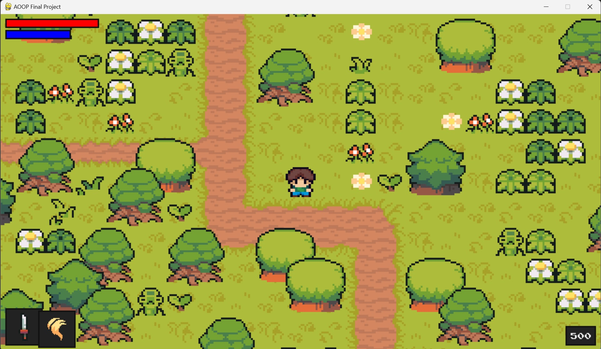
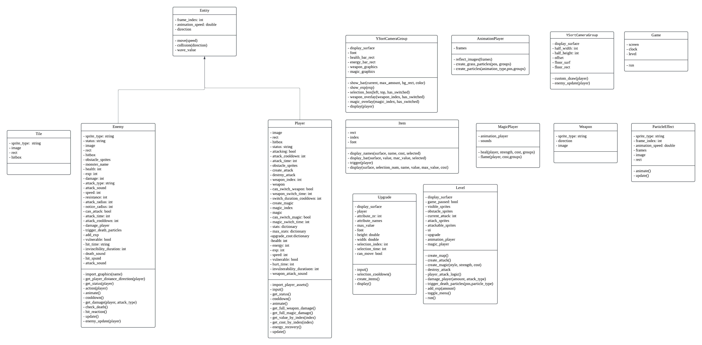
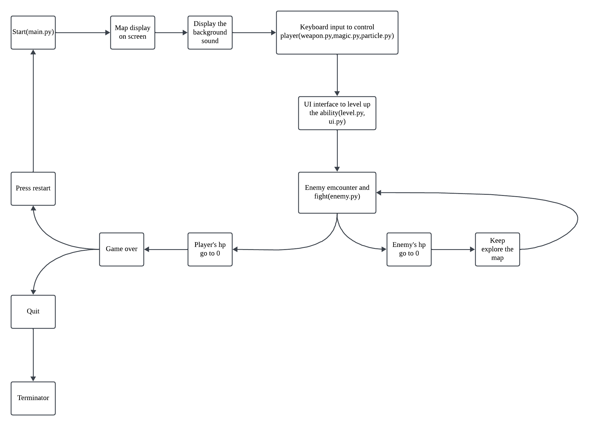

# 2024 AOOP-Final-Project
Group 10-Dark-soul like rpg

---
## Installation
* pygame
* clone this repo
## Briefly introduction
簡單的rpg遊戲
會固定生成地圖與魔物，使用鍵盤操作角色移動與戰鬥。
## Move
### Movement
|Keys|Actions|
|----|-------|
|↑↓←→|Move up/down/left/right|
### Switch Weapon/Magic
|Keys|Actions|
|----|-------|
|Q|change weapon|
|E|change magic|
### Attack
|Keys|Actions|
|----|-------|
|Space|Use weapon to attack|
|Ctrl+L|Use magic to attack|
### Level up the ability
|Keys|Actions|
|----|-------|
|M|Go into Menu|
|←→|Choose the ability want to level up|
|Space|Level up the ability|

## Diagram
### Class diagram

### Flow chart

## Report
[canvas page](https://www.canva.com/design/DAGbT5yKQDs/KIOhy--mSXLM4HQWmXuw4w/edit?ui=eyJEIjp7IlAiOnsiQiI6ZmFsc2V9fX0)

  
